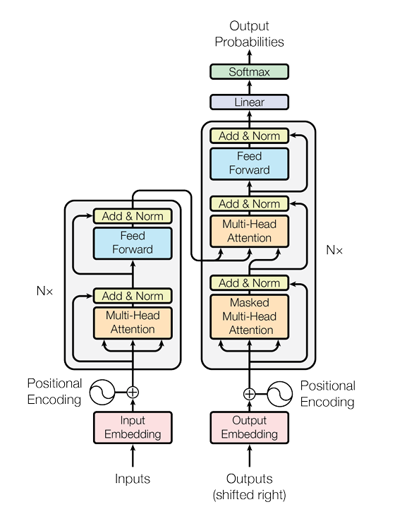

# Transformers-from-Scratch

## Table of Contents

- [Project](#Transformers-from-Scratch)
  - [Table of Contents](#table-of-contents)
  - [About The Project](#about-the-project)
  - [Demo](#demo)
  - [File Structure](#file-structure)
  - [Contributors](#contributors)
  - [References](#references)
  - [License](#license)
  

## About

Building a custom Transformer model from scratch in PyTorch for English-to-Spanish translation.



## File Structure
```
👨‍💻Transformers-from-Scratch
 ┣ 📂assets                            // Contains all the reference gifs, images
 ┣ 📂documentation                     // Contains documentation and my notes on transformers
 ┃ ┣ 📄Transformers.pdf
 ┃ ┣ 📄README.md
 ┣ 📄model.py                          // Code for Transformer Architecture
 ┣ 📄README.md
     
``` 

## References
* <a href="https://www.youtube.com/watch?v=ISNdQcPhsts&t=2729s">Link</a> to the YouTube video by Umar Jamil.
* <a href="https://arxiv.org/abs/1706.03762">Link</a> to 'Attention is all you need' paper explaining transformer architecture
 
## License
[MIT License](https://opensource.org/licenses/MIT)