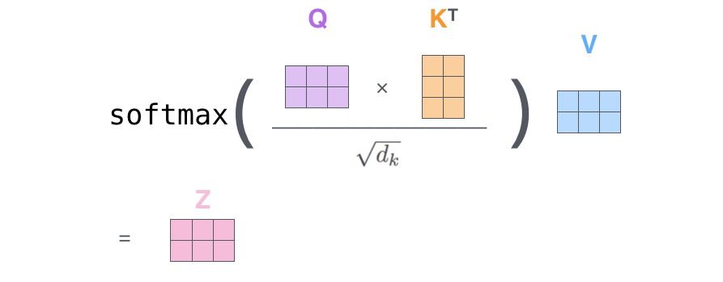
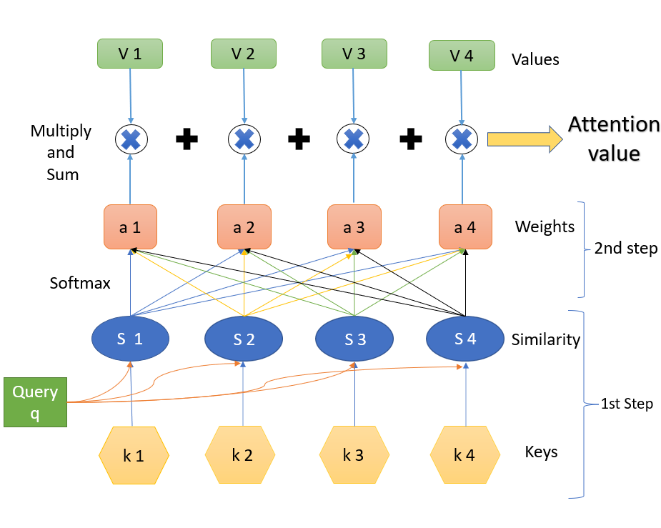

# Transformers: Attention is all you need

## Introduction

In order to improve the RNN architecture, which faces issues such as vanishing gradients, architectures such as GRUs and LSTMs were intorduced. Compared to RNN, these models could capture long term context. However, these are still sequential models. There is this notion of reccurence which acts as a bottleneck for computations. Furthermore, parallelization is not possible. 

The transformer architecture is based on ideas of attention and CNNs. The key concepts include:

* embeddings and positional encodings
* Self Attention
* Multi-Head Attention

## Embeddings and Positional Encodings

## Self Attention

For each word, we create a attention representation. Consider ```The cat jumped over the fence```. Hence our task is to compute values ```A<1>```, ```A<2>``` ... ```A<6>```. These calculations are done parallely, unlike the attention model of RNNs.

The equation for calculation of these attention values is:



### Idea of Key, Query, Value



Each of the input word is associated with a query, key and value pair. Thus ```A<1>``` has its own set of ```q<1>```, ```k<1>```, ```v<1>```.

Very similar to the idea of databases, query for each word is a question, how relevant is this word to context. This query is compared with keys of all words and likewise their values are extracted. The summation of these values give the attention representation for the given word with respect to all other words in the sentence.

## Multi-Head Attention