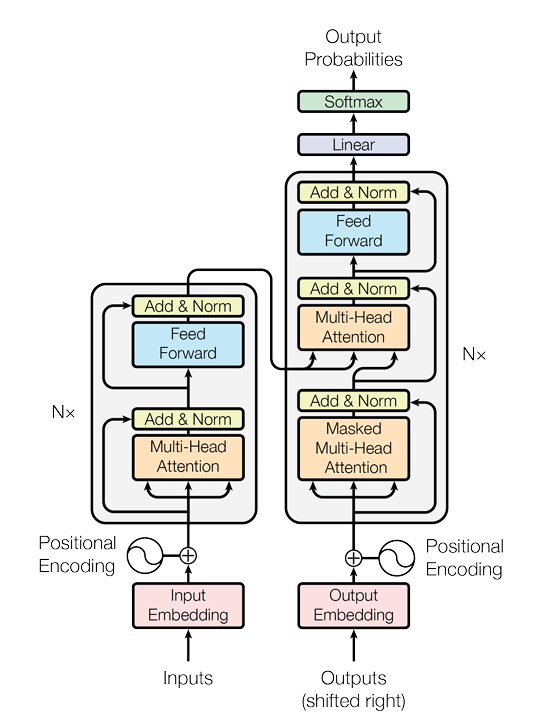

# Transformers: Attention is all you need

<p align="center">
    
</p>

## Introduction

A neural network is nothing but a function, which maps the input ```x``` to output ```y```

Neural Networks: ```y = f(x)```

However, when we deal with sequential data, our output depends on the sequence of input. Hence, we make use of Reccurent Neural Networks (RNN's).

Reccurent Neural Networks: ```y = f(x(t), h(t-1))```

In order to improve the RNN architecture, which faces issues such as vanishing gradients, architectures such as GRUs and LSTMs were intorduced. Compared to RNN, these models could capture long term context. However, these are still sequential models. There is this notion of reccurence which acts as a bottleneck for computations. Furthermore, parallelization is not possible. 

Sequence Transduction often involves converting a sequence of input data into a corresponding sequence of output data. This is useful for applications such as Machine Translation, Text Summarization etc. The encoder-decoder model is widely used for such Sequence Transduction tasks. Transformer architecture involves connecting encoder and decoder through Attention mechanism.

The transformer architecture is based on ideas of attention and CNNs. The encoder maps an input sequence of symbol representations (x1, ..., xn) to a sequence of continuous representations z = (z1, ..., zn). Given z, the decoder then generates an output sequence (y1, ..., ym) of symbols one element at a time.

The fundamental blocks of transformer architecture are:

* Embeddings 
* Positional Encodings
* Add & Norm (Layer Normalization & Residual Connection)
* Multi-Head Attention

## Embeddings

Neural Networks can understand patterns in anything but numbers. Hence we need to convert our input to a vector. There are two ways to map input sequence to vectors:

* One-hot vector encodings
* Word Embeddings

The idea behind word embeddings is that the number of rows in the vector represt different features of the word. The embedding layer is a mapping between input word and a vector of length 512 in our case. 


We make use of <a href="https://pytorch.org/docs/stable/generated/torch.nn.Embedding.html">nn.Embeddings</a> provided by PyTorch, which initializes an embedding layer with random weights by default.

## Positional Encodings

In sequence to sequence tasks, the relative order of your data is extremely important to its meaning. Consider the following example where change in order of data leads to different meaning.

Sequence 1: ```The cat chased the mouse.```

Sequence 2: ```The mouse chased the cat.```

In case of RNNs, the order was maintained by recurrence. However, in transformers we eliminated recurrence by squashing input together. Thus, we make use of positional encodings which allow transformers to capture positional information.


The idea behind positional encoding is that it should have following characterisitics:

* It should output a unique encoding for each time-step
* Distance between any two time-steps should be consistent across sentences with different lengths.
* It should generalize to longer sentences without any efforts. Its values should be bounded.
* It must be deterministic.

Positional encoding is not represent as number. Instead, it’s a 512-dimensional vector that contains information about a specific position in a sentence. This vector is used to equip each word with information about its position in a sentence. In other words, we enhance the model’s input to inject the order of words. Now the input itself contains both semantic and positional meaning.

## Self Attention

For each word, we create a attention representation. Consider ```The cat jumped over the fence```. Hence our task is to compute values ```A<1>```, ```A<2>``` ... ```A<6>```. These calculations are done parallely, unlike the attention model of RNNs.

The equation for calculation of these attention values is:


The ```Q```, ```K```, ```V``` matrices here are simply embedding matrices of size ```(max_seq_len, embedding_dim)```.

### Idea of Key, Query, Value


Each of the input word is associated with a query, key and value pair. Thus ```A<1>``` has its own set of ```q<1>```, ```k<1>```, ```v<1>```.

Very similar to the idea of databases, query for each word is a question, how relevant is this word to context. This query is compared with keys of all words and likewise their values are extracted. The summation of these values give the attention representation for the given word with respect to all other words in the sentence.

Additionally, Self Attention does not require any new learnable parameters since it uses embeddings and positional encodings. Also, we use masks in Self Attention to avoid interaction of few words (for eg. PAD token).

## Multi-Head Attention

Multi-Head Attention is performing Self Attention multiple times. This allows us to compute a richer attention vector. Here, the intuition is that different heads would pose different questions and hence understand a different ascpect of input sequence.


Unlike Self Attention, we use weight matrices ```Wq```, ```Wk```, ```Wv``` to compute ```Q```, ```K```, ```V```.

Additionally, we feed the entire input sequence to all the heads. However the embeddings that all these heads see are different. This is what leads them to understand different aspects of input sequence.

Q: interesting questions about the words in sentence
K: qualities of words 
V: specific representation of the word

## References

* <a href="https://github.com/hkproj/transformer-from-scratch-notes/tree/main">GitHub Link</a> to transformers-from-scratch-notes repository.
* Sequence Models course by deeplearning.ai on coursera.